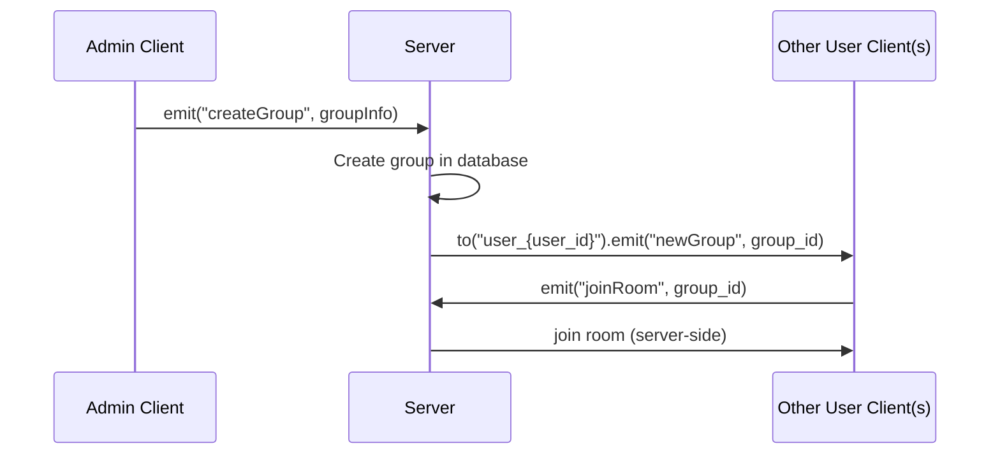

# GROUP MODULE

### Flow create group
1. Admin gửi yêu cầu tạo nhóm:
     + Client gọi emit("createGroup", groupInfo).
2. Server xử lý tạo nhóm:
     + Ghi vào DB, sinh group_id.
3. Server gửi thông báo đến các user liên quan:
     + Sử dụng to("user_{user_id}").emit("newGroup", group_id) cho từng người dùng trong nhóm.
4. User nhận thông báo và emit joinRoom:
     + Client tự động emit("joinRoom", group_id) để server cho socket đó vào room.
5. Server thêm socket vào room:
     + Dùng client.join(group_id)

